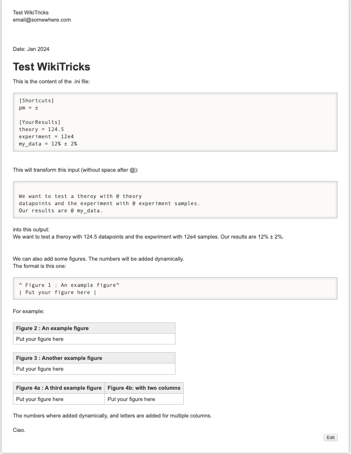

## WikiTricks


### What is WikiTricks?

WikiTricks is a set of tools for working with DokuWiki. It is for now just a simple script to handle the definition of variables to use in a note and the dynamic numbering of Figures. 

### How to use variables?

Write your note in a file with the extension `example.dokuwiki` and use the following syntax to define a variable. You can use variables inside the note using the syntax `@variable_name`. 
Your variables can be defined in a file called `example.ini`, in the same folder as your note. The values are just plain text. 

When you are done with writing, run: 

```bash
source update.sh example.dokuwiki
```

This will create a file called `example.out` with the variables replaced by their values.


### How to use dynamic numbering of Figures?

Write your note in a file with the extension `example.dokuwiki` and use the following syntax to define a figure. 

```
^ Figure : Title ^
| yourfigure.png | 
```

the script will replace the `Figure` by the number of the figure. 

When you are done with writing, run: 

```bash 
source update.sh example.dokuwiki
```

just as before. 

### Example

Here is an example of usage. 

